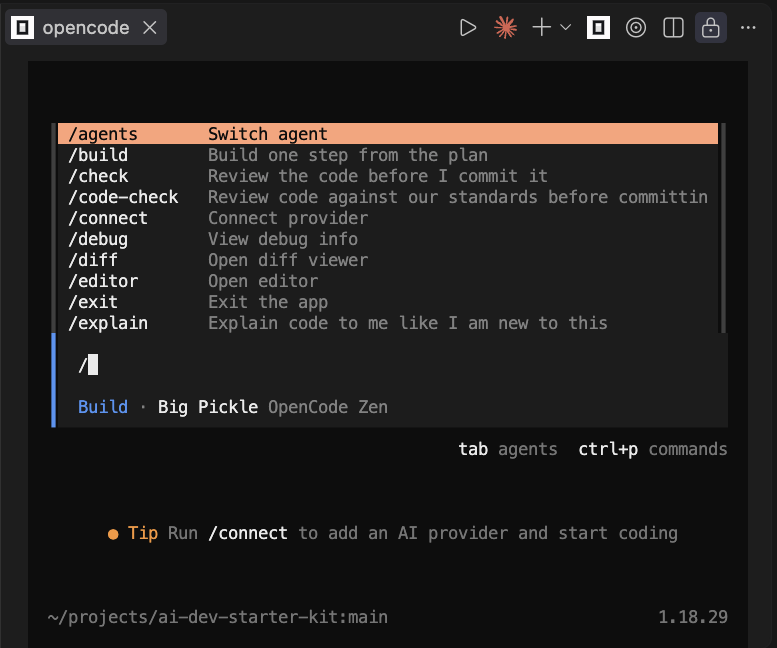
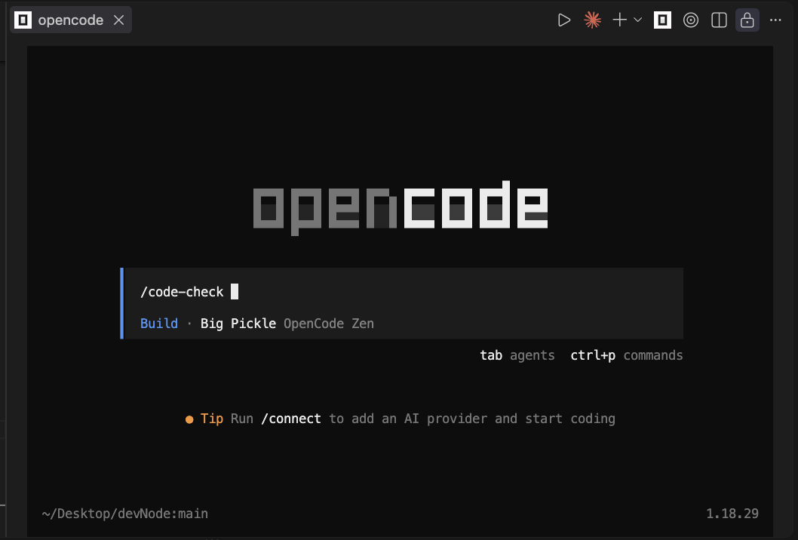
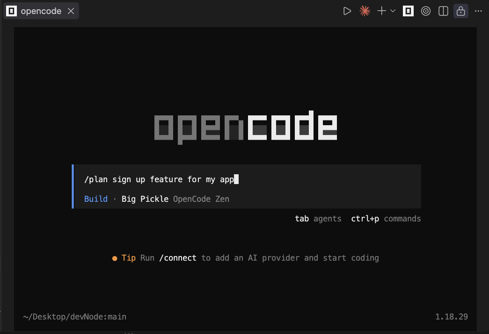
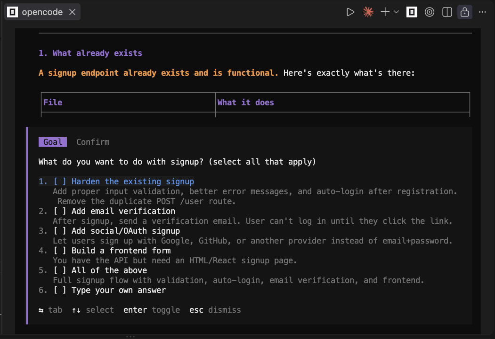
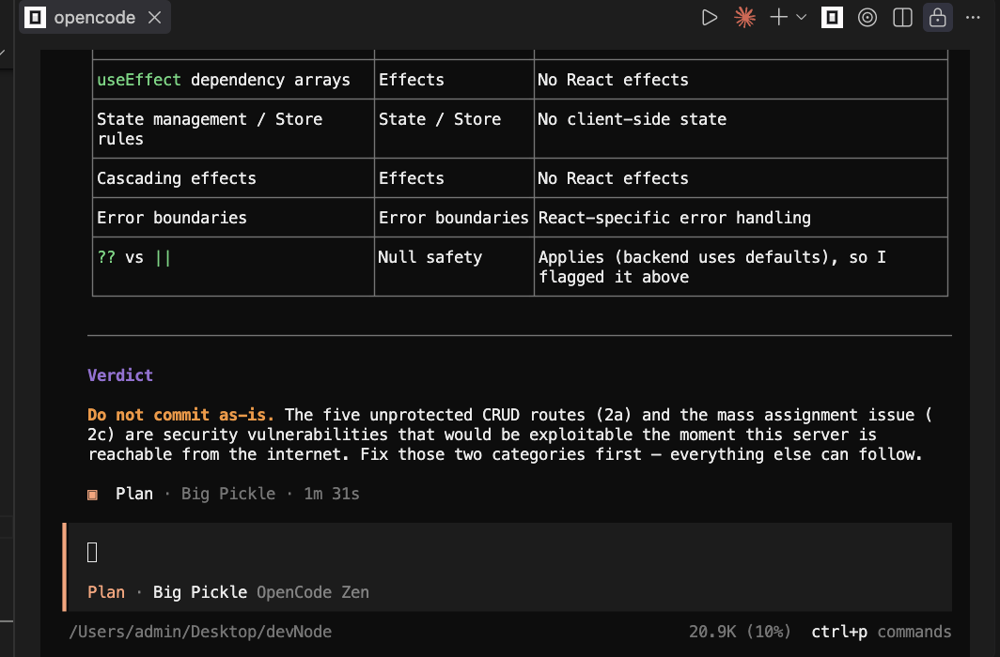
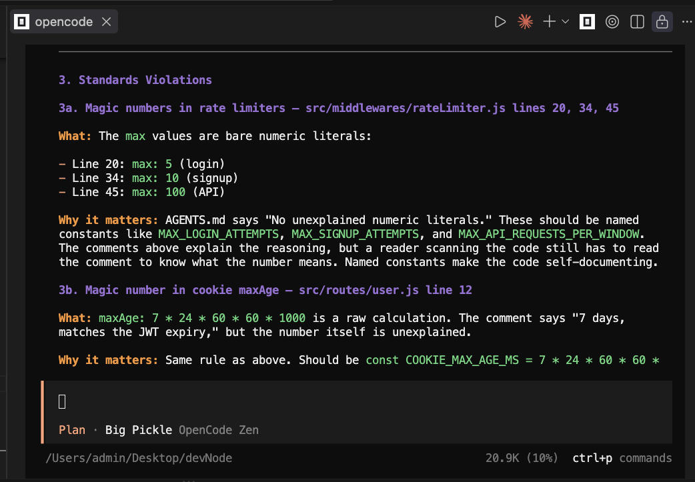

# AI dev starter kit

Build software with AI, for free. No subscription, no API key, no credit card.

Six commands that make an AI agent behave like a good senior developer: plan
before it builds, build one step at a time, review before it commits.



Made for people starting out — founders with an idea, junior developers, anyone
who wants to build without paying for tools.

---

## ⚡ Install once, use everywhere

Already have OpenCode? Four commands and you are done.

```bash
git clone https://github.com/Jaykukreja/ai-dev-starter-kit.git
```

```bash
mkdir -p ~/.config/opencode
```

```bash
cp -r ai-dev-starter-kit/.opencode/commands ~/.config/opencode/
```

```bash
cp ai-dev-starter-kit/opencode.json ~/.config/opencode/
```

Open any project, run `opencode`, type `/`. The six commands are there.

**One extra step per project.** Copy `AGENTS.md` into each repo you want the
coding standards applied to. It holds project-specific rules, so it lives with
the project rather than globally.

```bash
cp ai-dev-starter-kit/AGENTS.md /path/to/your-project/
```

Then open it and edit — your stack, your rules, how to run and test it.

**Do not have OpenCode yet?** Keep reading.

---

## 💻 Recommended — use it inside VS Code

Open Extensions (`Cmd + Shift + X`), search **"OpenCode Beta"** by SST, install.

It puts OpenCode in a pane right next to your files, so you can watch the code
change as it happens. Much easier to follow than a bare terminal, especially
when you are learning.

Works fine without it. But do this one.

---

## 📦 Installing OpenCode

About ten minutes. All free.

### Step 1 — Install it

**Option A — Terminal (recommended)**

Open the Terminal app. On a Mac, press `Cmd + Space`, type "Terminal", press
Enter.

Paste this and press Enter:

```bash
curl -fsSL https://opencode.ai/install | bash
```

Or if you already use Homebrew:

```bash
brew install anomalyco/tap/opencode
```

**Option B — Desktop app**

If a terminal feels intimidating, go to
[opencode.ai/download](https://opencode.ai/download), download OpenCode Desktop
for macOS (Apple Silicon or Intel, matching your Mac), open the `.dmg`, drag the
icon into Applications.

### Step 2 — Add this kit

Run the four commands from [Install once, use everywhere](#install-once-use-everywhere)
above.

### Step 3 — Start it

```bash
opencode
```

`command not found`? Close the terminal, open a new one, try again. The
installer needs a fresh window.

Free models are already set up. No API key. No account.

### Step 4 — Check it works

Type this and press Enter:

```
/plan a landing page with a headline and an email signup form
```

If it starts asking questions about your landing page, you are ready.

---

## 🛠 The six commands

| Command | When to use it |
|---|---|
| `/plan <what you want>` | Design it before you build it. |
| `/build <one step>` | Build one step from the plan. |
| `/explain <file>` | You do not understand something. |
| `/code-check` | Before you commit. Reviews against the standards. |
| `/stuck <what broke>` | Walks you to the cause. Does not fix it for you. |
| `/save` | Commit safely. |

---

## 🎯 Pick your way in

You do not have to use all of this. Take what is useful.

### 🔍 "I just want my code reviewed"

Open any project and run:

```
/code-check src/routes/user.js
```

That is it. It reads your code against the rules in `AGENTS.md` and tells you
what is wrong and why. Nothing else here has to be used.



Plenty of people never use anything else. Fine.

### 🦆 "I get stuck and want a rubber duck that talks back"

```
/stuck the login form submits but the page never redirects
```

It will not fix it. It translates the error, gives you its best guess, and tells
you the one thing to check first. You do the finding.

That is on purpose. The debugging muscle only grows if you use it.

### 🗺 "I inherited a codebase and I am lost"

```
/explain src/middlewares/auth.js
```

Line by line, plain English, every term defined. Ask as often as you like — it
costs nothing and nobody is judging you.

### 🚀 "I want to build something from scratch"

Use the whole loop. Next section.

---

## 🔁 The full loop

What an actual session looks like.

**1. Describe what you want**

```
/plan a landing page with a headline, a description, and an email signup form
```

It asks you questions. What is the product? Where do the emails go? Answer in
plain English.



You get back a numbered plan — maybe six steps.



**2. Save before you start**

```
/save
```

Now anything that goes wrong can be undone. This makes experimenting free.

**3. Build step one**

```
/build step 1 - create the page file with a basic layout
```

It tells you what it is about to change. **Read that.** Press `y` to approve.
It makes the change, then tells you exactly how to check it.

**4. Check it**

Run what it told you to run. Look at the result. Does it match what you asked
for?

**5. Repeat, one step at a time**

`/build step 2`, then `/build step 3`. Check after each one.

Never batch them. If step 3 breaks, you want to know it was step 3.

**6. Lost?**

```
/explain app/page.tsx
```

**7. Broken?**

```
/stuck the form submits but nothing happens, no error in the console
```

**8. Before you commit**

```
/code-check
```

**9. Save**

```
/save
```

**10. Next thing**

```
/new
```

Fresh conversation. Back to step 1.

---

That is the whole thing:

**`/plan` → `/save` → `/build` × N → `/code-check` → `/save` → `/new`**

The discipline is in the loop, not the tool. Skip `/plan` and ask for the whole
app at once and you will get a mess — on any AI, at any price.

---

## 🔍 What a review looks like

`/code-check` reports by severity and explains why each thing matters. It does
not fix anything. You fix it, so you learn it.





---

## 💬 How to ask for things

This matters more than which AI you use. Free models are good at small clear
tasks and bad at big vague ones.

| Do not say | Say instead |
|---|---|
| "Build me a login system" | "Add a login form with email and password that posts to /api/session" |
| "Make it look better" | "Make the signup button full width on mobile, 16px padding" |
| "Fix the bug" | "The form submits but does not redirect. Error: [paste it]" |
| "Add a database" | "Add a users table with id, email, and created_at columns" |

**The test:** could you check whether it worked in under ten minutes? If not, it
is too big. Split it.

---

## ⌨️ Getting around

These come with OpenCode, not this kit.

| What | How |
|---|---|
| Stop it mid-task | `Esc` |
| Start a fresh conversation | `/new` |
| Switch model | `/models` |
| Go back to an old conversation | `/sessions` |
| See every command | `Ctrl + P` |
| Add a file to your message | Type `@` then the filename |
| Attach a screenshot | Drag the image onto the window |
| Quit | `/exit` or `Ctrl + C` |

**`/new` is the one you will use most.** Finish a task, `/new`, start the next.
Long sessions fill up and the model starts forgetting the beginning. Watch the
percentage in the bottom right — past 50%, start fresh.

**`/models`** lists the free models. Big Pickle is the default and handles
everything well. If it ever stops working, pick another.

---

## 🧠 Five rules that will save you

- **`/save` before every `/build`.** Undo is free, so experimenting is free.
- **`/new` for each new thing.** Keeps context small and the model sharp.
- **Read what it is about to do.** It asks before editing. That is not a
  formality.
- **Debug for 20 minutes before asking.** This is the habit that turns you into
  someone who can build things.
- **If you cannot explain a line, you do not own it.** Use `/explain` until you
  can.

---

## 📁 Files

| File | What it does | Where it goes |
|---|---|---|
| `.opencode/commands/` | The six commands. | `~/.config/opencode/` — global |
| `opencode.json` | Model and permissions. | `~/.config/opencode/` — global |
| `AGENTS.md` | The rulebook. Read silently every session. | Each project root |

The rules live in `AGENTS.md` rather than inside each command, so they apply
while code is being written — not only when you review it.

**Make `AGENTS.md` yours.** Delete rules that do not fit. Add your own. It is a
starting point, not scripture.

---

## 🚨 When something breaks

**"Model not found"** — free models get renamed and retired. Run `/models` and
pick a working one. Two-minute fix, not a crisis.

**Rate limited** — wait, or add a second free provider. Groq
(`console.groq.com`) is a one-minute signup, no card. Google AI Studio
(`aistudio.google.com`) gives around 1,500 requests a day, also no card. Connect
either with `/connect`.

**Taking forever** — you asked for too much at once. Point it at one file:
`/code-check src/routes/user.js`.

**It keeps getting it wrong** — your task is too big. Cut it in half.

---

## ⚠️ What this will not do

It will not tell you whether anyone wants what you are building.

Talk to people before you build. Keep talking to them while you build. Shipping
something is not the same as someone wanting it, and AI has made building so
cheap that skipping this step has never been more tempting or more fatal.

---

## 📄 Licence

MIT. Take it, change it, use it however you like.
